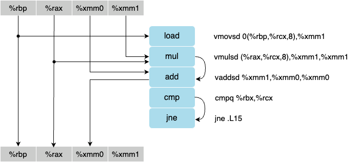
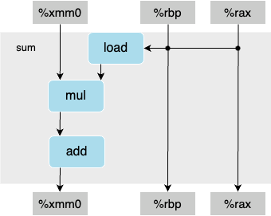

#### 5.13
A. As Figure 1 shows, the critical path of operations is determined by the data dependencies between instructions. In this case, the critical path includes the `vmulsd` and `vaddsd` instructions. The `vaddsd` instruction depends on the result of the `vmulsd` instruction, and thus the `vmulsd` instruction creates a data dependency on the memory load (`vmovsd`) instruction. Therefore, the critical path includes the instructions `vmovsd`, `vmulsd`, and `vaddsd`, as shown in Figure 2.
<source media="(prefers-color-scheme: light)" srcset="diagram.png">

<b>Figure 1. Data flow diagram</b>
<br/><br/>
<source media="(prefers-color-scheme: light)" srcset=".png">

<b>Figure 2. Abstract data dependency</b>
<br/><br/>

B. For data type double, the lower bound on the CPE (cycles per element) is determined by the critical path, which includes the `vmovsd`, `vmulsd`, and `vaddsd` instructions. Since the multiplication (`vmulsd`) instruction requires 5 clock cycles, the lower bound on the CPE for double data is 5.

C. Assuming similar instruction sequences for the integer code, the lower bound on the CPE for integer data would also be determined by the critical path, which would be 3 in this case determined by the lower bound on the CPE.

D. The floating-point versions can have CPEs of 3.00, even though the multiplication operation requires 5 clock cycles, because the floating-point instructions can be executed in parallel using pipelining. We know from Figure 5.12 that there are two functional units capable of performing floating-point multiplication. While one multiplication operation is in progress, subsequent instructions can be executed on separate execution units in parallel, thus allowing for increased throughput and higher CPE values compared to the latency of individual instructions.

#### 5.14
```c
void inner_unrolled(vec_ptr u, vec_ptr v, data_t *dest) {
    long i;
    long length = vec_length(u);
    data_t *udata = get_vec_start(u);
    data_t *vdata = get_vec_start(v);
    data_t sum = (data_t)0;

    for (i = 0; i < length - 5; i += 6) {
        sum = sum + udata[i] * vdata[i];
        sum = sum + udata[i + 1] * vdata[i + 1];
        sum = sum + udata[i + 2] * vdata[i + 2];
        sum = sum + udata[i + 3] * vdata[i + 3];
        sum = sum + udata[i + 4] * vdata[i + 4];
        sum = sum + udata[i + 5] * vdata[i + 5];
    }

    // Handle remaining elements
    for (; i < length; i++) {
        sum = sum + udata[i] * vdata[i];
    }

    *dest = sum;
}
```

A. Because each iteration of the loop is dependent on the result of the previous iteration. The processor needs to wait for the result of each multiplication and addition operation before proceeding to the next iteration. This inherent dependency limits the potential parallelism and instruction overlap, resulting in a minimum CPE of 1.00.

B. That is because the bottleneck lies in the latency of floating-point arithmetic operations, such as multiplications and additions. Loop unrolling increases the number of operations performed in parallel, which can help to hide memory access latency. However, it does not reduce the latency of individual floating-point operations. The unrolled version still requires the same number of floating-point operations, and their latencies remain unchanged. Therefore, the performance improvement achieved through loop unrolling is limited for floating-point data.

#### 5.15
```c
void inner_unrolled(vec_ptr u, vec_ptr v, data_t *dest) {
    long i;
    long length = vec_length(u);
    data_t *udata = get_vec_start(u);
    data_t *vdata = get_vec_start(v);
    data_t sum1 = (data_t)0;
    data_t sum2 = (data_t)0;
    data_t sum3 = (data_t)0;
    data_t sum4 = (data_t)0;
    data_t sum5 = (data_t)0;
    data_t sum6 = (data_t)0;

    for (i = 0; i < length - 5; i += 6) {
        sum1 += udata[i] * vdata[i];
        sum2 += udata[i + 1] * vdata[i + 1];
        sum3 += udata[i + 2] * vdata[i + 2];
        sum4 += udata[i + 3] * vdata[i + 3];
        sum5 += udata[i + 4] * vdata[i + 4];
        sum6 += udata[i + 5] * vdata[i + 5];

        sum1 += udata[i + 6] * vdata[i + 6];
        sum2 += udata[i + 7] * vdata[i + 7];
        sum3 += udata[i + 8] * vdata[i + 8];
        sum4 += udata[i + 9] * vdata[i + 9];
        sum5 += udata[i + 10] * vdata[i + 10];
        sum6 += udata[i + 11] * vdata[i + 11];

        sum1 += udata[i + 12] * vdata[i + 12];
        sum2 += udata[i + 13] * vdata[i + 13];
        sum3 += udata[i + 14] * vdata[i + 14];
        sum4 += udata[i + 15] * vdata[i + 15];
        sum5 += udata[i + 16] * vdata[i + 16];
        sum6 += udata[i + 17] * vdata[i + 17];

        sum1 += udata[i + 18] * vdata[i + 18];
        sum2 += udata[i + 19] * vdata[i + 19];
        sum3 += udata[i + 20] * vdata[i + 20];
        sum4 += udata[i + 21] * vdata[i + 21];
        sum5 += udata[i + 22] * vdata[i + 22];
        sum6 += udata[i + 23] * vdata[i + 23];

        sum1 += udata[i + 24] * vdata[i + 24];
        sum2 += udata[i + 25] * vdata[i + 25];
        sum3 += udata[i + 26] * vdata[i + 26];
        sum4 += udata[i + 27] * vdata[i + 27];
        sum5 += udata[i + 28] * vdata[i + 28];
        sum6 += udata[i + 29] * vdata[i + 29];

        sum1 += udata[i + 30] * vdata[i + 30];
        sum2 += udata[i + 31] * vdata[i + 31];
        sum3 += udata[i + 32] * vdata[i + 32];
        sum4 += udata[i + 33] * vdata[i + 33];
        sum5 += udata[i + 34] * vdata[i + 34];
        sum6 += udata[i + 35] * vdata[i + 35];
    }

    // Handle remaining elements
    for (; i < length; i++) {
        sum1 += udata[i] * vdata[i];
    }

    *dest = sum1 + sum2 + sum3 + sum4 + sum5 + sum6;
}
```

The factor that limits the performance to a CPE of 1.00 in this case is the dependency between consecutive iterations of the loop. Each iteration still depends on the result of the previous iteration due to the accumulation of the sums. This dependency creates a serial chain of operations, where the processor needs to wait for each multiplication and addition to complete before proceeding to the next iteration. Despite loop unrolling, which increases the number of operations performed in parallel, the dependency between iterations introduces serialization in the critical path, limiting the achievable performance.

#### 5.16
```c
void inner_unrolled_reassoc(vec_ptr u, vec_ptr v, data_t *dest) {
    long i;
    long length = vec_length(u);
    data_t *udata = get_vec_start(u);
    data_t *vdata = get_vec_start(v);
    data_t sum = (data_t)0;

    for (i = 0; i < length - 5; i += 6) {
        sum = sum + (udata[i] * vdata[i]
                  + udata[i + 1] * vdata[i + 1]
                  + udata[i + 2] * vdata[i + 2]
                  + udata[i + 3] * vdata[i + 3]
                  + udata[i + 4] * vdata[i + 4]
                  + udata[i + 5] * vdata[i + 5]);
    }

    // Handle remaining elements
    for (; i < length; i++) {
        sum = sum + udata[i] * vdata[i];
    }

    *dest = sum;
}
```

#### 5.17
```c
void *efficient_memset(void *s, int c, size_t n) {
    size_t cnt = 0;
    unsigned char *schar = s;
    unsigned long word = 0;

    // Perform byte-level writes until s is aligned to a multiple of K
    while (cnt < n && ((size_t)schar % sizeof(unsigned long)) != 0) {
        *schar++ = (unsigned char)c;
        cnt++;
    }

    // Create a word with eight copies of c
    for (int i = 0; i < sizeof(unsigned long); i++) {
        word <<= 8;
        word |= (unsigned char)c;
    }

    // Perform word-level writes (eight bytes at a time)
    unsigned long *sword = (unsigned long *)schar;
    while (cnt + sizeof(unsigned long) <= n) {
        *sword++ = word;
        cnt += sizeof(unsigned long);
    }

    // Perform any remaining byte-level writes
    schar = (unsigned char *)sword;
    while (cnt < n) {
        *schar++ = (unsigned char)c;
        cnt++;
    }

    return s;
}
```
This code ensures portability by using the `sizeof` operator, and it works efficiently for arbitrary values of n, even when n is not a multiple of K.

#### 5.18
- Horner's method:

```c
double polyh(double a[], double x, long degree) {
    long i;
    double result = a[degree];
    for (i = degree - 1; i >= 0; i--) {
        result = a[i] + x * result;
    }
    return result;
}
```

- Different Variants
    1. **Loop Unrolling**
    2. **Parallel Accumulation**
    3. **Reassociation**
```c
// 1. We manually expand the loop body, reducing loop control overhead
double polyh_unrolled(double a[], double x, long degree) {
    long i;
    double result = a[degree];

    // Unroll the loop with a factor of 2
    for (i = degree - 1; i >= 1; i -= 2) {
        result = a[i - 1] + x * (a[i] + x * result);
    }

    // Handle the remaining odd-degree term if any
    if (i == 0) {
        result = a[0] + x * result;
    }

    return result;
}
```

    

```c
// 2. We use multiple accumulators to compute intermediate results in parallel
double polyh_parallel(double a[], double x, long degree) {
    long i;
    double result1 = 0.0;
    double result2 = 0.0;

    // Parallel accumulation with a factor of 2
    for (i = degree; i >= 2; i -= 2) {
        result1 = a[i - 1] + x * result1;
        result2 = a[i] + x * result2;
    }

    // Handle the remaining odd-degree term if any
    if (i == 1) {
        result1 = a[0] + x * result1;
    }

    // Combine the results
    return a[degree] + x * result2 + x * result1;
}
```

```c
// 3. We reorder the operations to minimize the number of operations
double polyh_reassoc(double a[], double x, long degree) {
    long i;
    double result = 0.0;

    // Reassociate the operations for better pipelining
    for (i = 0; i <= degree; i++) {
        result = result * x + a[i];
    }

    return result;
}
```
<br/>

We can mix them together in order to achieve a higher CPE.
```c
double polyh_mixed(double a[], double x, long degree) {
    long i;
    double result = 0.0;

    // Unroll the loop with a factor of 2 and use parallel accumulation
    for (i = degree; i >= 2; i -= 2) {
        result = result * x + a[i];
        result = result * x + a[i - 1];
    }

    // Handle the remaining odd-degree term if any
    if (i == 1) {
        result = result * x + a[0];
    }

    return result;
}
``` 

#### 5.19

```c
void psum_optimized(float a[], float p[], long n) {
    long i;
    float last_val, val1, val2, val3, val4;

    // Process the first four elements to prime the pump
    val1 = p[0] = a[0];
    val2 = p[1] = val1 + a[1];
    val3 = p[2] = val2 + a[2];
    val4 = p[3] = val3 + a[3];

    // Main loop with four-way unrolling and reassociation
    for (i = 4; i < n; i += 4) {
        val1 = val4 + a[i];
        val2 = val1 + a[i + 1];
        val3 = val2 + a[i + 2];
        val4 = val3 + a[i + 3];

        p[i] = val1;
        p[i + 1] = val2;
        p[i + 2] = val3;
        p[i + 3] = val4;
    }
}
```

We process four elements at a time in order to reduce the number of loop iterations and better utilizing the CPU's parallelism. But finally, the CPE we achieved was limited by the available functional units inside the CPU.