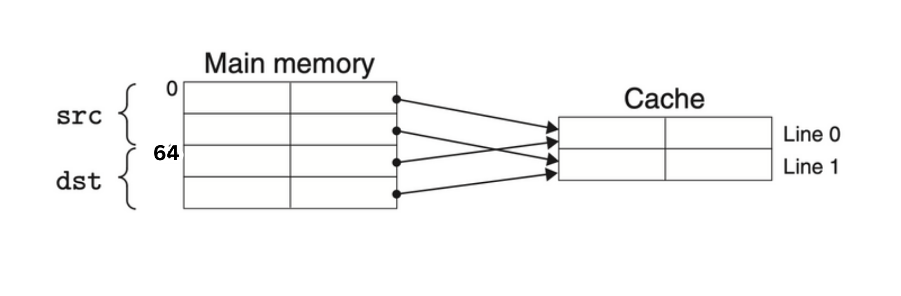

#### 6.22
Given:
- BPT (bits per track) = x * 2πr (circumference of the innermost track)
- TC (track count) = (1 - x) * 2πr (circumference of the outermost track)
- BC (bit count) = BPT * TC (total bits on the disk)

We want to find the value of x that maximizes BC.

Substitute BPT and TC into BC:
BC = (x * 2πr) * ((1 - x) * 2πr)

Expand and simplify the equation:
BC = 4π^2 * x * (1 - x) * r^2

Now, we have a quadratic equation in terms of x. To find the maximum value of BC, we need to find the vertex of this quadratic equation. The x-coordinate of the vertex can be found using the formula x = -b / 2a, where a = 4π^2 * r^2 and b = -4π^2 * r^2.

x = -(-4π^2 * r^2) / (2 * 4π^2 * r^2)\
x = 1/2

The value of x that maximizes BC is 1/2. Therefore, when the radius of the hole is half the radius of the platter (x * r = 1/2 * r), the capacity of the disk is maximized.

#### 6.23
Given parameters:
- Rotational rate: 12,000 RPM (Revolutions Per Minute)
- Tavg seek: 3 ms (Average Seek Time)
- Average number of sectors/track: 500

1. Rotational Latency:
T<sub>avg rotation</sub> = 1/2 * T<sub>max rotation</sub>\
T<sub>avg rotation</sub> = 1/2 * (60 seconds / 12,000 RPM) * 1000 ms/sec\
T<sub>avg rotation</sub> ≈ 2.5 ms

2. Transfer Time:
T<sub>avg transfer</sub> = (60 seconds / 12,000 RPM) * (1 / 500 sectors/track) * 1000 ms/sec\
T<sub>avg transfer</sub> ≈ 0.01 ms

3. Average Access Time:
T<sub>access</sub> = T<sub>avg seek</sub> + T<sub>avg rotation</sub> + T<sub>avg transfer</sub>\
T<sub>access</sub> = 3 ms + 2.5 ms + 0.01 ms ≈ 5.51 ms


So, the average time to access a sector on the disk is approximately 5.51 milliseconds (ms).

#### 6.24
First we need to determine a few basic properties of the file and the disk. The file consists of 20,000 512-byte logical blocks. For the disk, T<sub>avg seek</sub> = 8 ms, T<sub>max rotation</sub> = 3.34 ms, and T<sub>avg rotation</sub> = 1.67 ms.
<br/>

A. Best case: In the optimal case, the blocks are mapped to contiguous sectors, on the same cylinder, that can be read one after the other without moving the head. Once the head is positioned over the first sector it takes two full rotations (5,000 sectors per rotation) of the disk to read all 10,000 blocks. So the total time to read the file is T<sub>avg seek</sub> + T<sub>avg rotation</sub> + 2 × T<sub>max rotation</sub> = 8 + 1.67 + 6.68 = 16.35 ms.
<br/>

B. Random case: In this case, where blocks are mapped randomly to sectors, reading each of the 10,000 blocks requires T<sub>avg seek</sub> + T<sub>avg rotation</sub> ms, so the total time to read the file is (T<sub>avg seek</sub> + T<sub>avg rotation</sub>) × 10,000 = 96,700 ms (96.7 seconds!).

#### 6.25
| Cache |  m   |   C   |  B   |  E   |  S   |  t   |  s   |  b   |
| :---: | :--: | :---: | :--: | :--: | :--: | :--: | :--: | :--: |
|  1.   |  32  | 1,024 |  4   |  4   |  64  |  24  |  6   |  2   |
|  2.   |  32  | 1,024 |  4   | 256  |  1   |  30  |  0   |  2   |
|  3.   |  32  | 1,024 |  8   |  1   | 128  |  22  |  7   |  3   |
|  4.   |  32  | 1,024 |  8   | 128  |  1   |  29  |  0   |  3   |
|  5.   |  32  | 1,024 |  32  |  1   |  32  |  22  |  5   |  5   |
|  6.   |  32  | 1,024 |  32  |  4   |  8   |  24  |  3   |  5   |

#### 6.26
| Cache |  m   |   C   |  B   |  E   |  S   |  t   |  s   |  b   |
| :---: | :--: | :---: | :--: | :--: | :--: | :--: | :--: | :--: |
|  1.   |  32  | 2,048 |  8   |  1   | 256  |  21  |  8   |  3   |
|  2.   |  32  | 2,048 |  4   |  4   | 128  |  23  |  7   |  2   |
|  3.   |  32  | 1,024 |  2   |  8   |  64  |  25  |  6   |  1   |
|  4.   |  32  | 1,024 |  32  |  2   |  16  |  23  |  4   |  5   |

#### 6.27
A. In this case, set 1 contains two valid lines with a tag of `0x45`, `0x38` respectively. Since there are two valid lines in the set, eight addresses will hit. We can know from the below fields, these addresses have the binary form `0 1000 1010 01xx` or `0 0111 0000 01xx`.
- CO: `??`
- CI: `0b001`
- CT: `0b01000101` or `0b00111000`

Thus, the eight hex addresses that hit in set 1 are `0x0704`, `0x0705`, `0x0706`, `0x0707`, `0x08A4`, `0x08A5`, `0x08A6` and `0x08A7`.

B. There are only one valid line in the set, and the same principle follows:
- CO: `??`
- CI: `0b110`
- CT: `0b10010001`

Thus, the four hex addresses that hit in set 6 are `0x1238`, `0x1239`, `0x123A` and `0x123B`.

#### 6.28
A. In this case, set 2 contains zero valid lines. Since there are none valid lines in the set, no addresses will hit.

B. In this case, set 4 contains two valid lines with a tag of `0xC7`, `0x05` accordingly. Since there are two valid lines in the set, eight addresses will hit. We can know from the below fields, these addresses have the binary form `1 1000 1111 00xx` or `0 0000 1011 00xx`.
- CO: `??`
- CI: `0b100`
- CT: `0b11000111` or `0b00000101`

Thus the eight hex addresses that hit in set 4 are `0x18F0`, `0x18F1`, `0x18F2`, `0x18F3`, `0x00B0`, `0x00B1`, `0x00B2` and `0x00B3`.

C. In this case, set 5 contains one valid line with a tag of `0x71`. Since there are only one valid line in the set, four addresses will hit. We can know from the below fields, these addresses have the binary form `0 1110 0011 01xx`.
- CO: `??`
- CI: `0b101`
- CT: `0b01110001`

Thus, the four hex addresses that hit in set 5 are `0x0E34`, `0x0E35`, `0x0E36` and `0x0E37`.

D. In this case, set 7 contains one valid lines with a tag of `0xDE`. Since there are only one valid line in the set, four addresses will hit. We can know from the below fields, these addresses have the binary form `1 1011 1101 11xx`.
- CO: `??`
- CI: `0b111`
- CT: `0b11011110`

Thus, the four hex addresses that hit in set 7 are `0x1BDC`, `0x1BDD`, `0x1BDE` and `0x1BDF`.

#### 6.29
A. Given the information, B = 4, S = 4, we can get b = 2, s = 2. Then, t = m - (s + b) = 12 - 4 = 8.
So the diagram should be like:
| N/A  |  CT  |  CT  |  CT  |  CT  |  CT  |  CT  |  CT  |  CT  |  CI  |  CI  |  CO  |  CO  |
| :--: | :--: | :--: | :--: | :--: | :--: | :--: | :--: | :--: | :--: | :--: | :--: | :--: |
|  12  |  11  |  10  |  9   |  8   |  7   |  6   |  5   |  4   |  3   |  2   |  1   |  0   |

B.
| Operation  |  Address  |  Hit?  |  Read value (or unknown)  |
| :--: | :--: | :--: | :--: |
|  Read  |  0x834  |  N  |  Unknown   |
|  Write  |  0x836  |  Y  |  Unknown   |
|  Read  |  0xFFD  |  Y  |  0xC0   |

#### 6.30
A. Given the information, E = 4, B = 4, S = 8, so we can get the size (C) of this cache is 128 bytes.

B.
|  CT  |  CT  |  CT  |  CT  |  CT  |  CT  |  CT  |  CT  |  CI  |  CI  |  CI  |  CO  |  CO  |
| :--: | :--: | :--: | :--: | :--: | :--: | :--: | :--: | :--: | :--: | :--: | :--: | :--: |
|  12  |  11  |  10  |  9   |  8   |  7   |  6   |  5   |  4   |  3   |  2   |  1   |  0   |

#### 6.31
A.
|  0  |  0  |  1  |  1  |  1  |  0  |  0  |  0  |  1  |  1  |  0  |  1  |  0  |
| :--: | :--: | :--: | :--: | :--: | :--: | :--: | :--: | :--: | :--: | :--: | :--: | :--: |
|  12  |  11  |  10  |  9   |  8   |  7   |  6   |  5   |  4   |  3   |  2   |  1   |  0   |

B.
|      Parameter      | Value |
| :-----------------: | :---: |
|  Block offset (CO)  | 0x02  |
|     Index (CI)      | 0x06  |
|   Cache tag (CT)    | 0x38  |
|  Cache hit? (Y/N)   |   N   |
| Cache byte returned |   —   |

#### 6.32
A.
|  1  |  0  |  1  |  1  |  0  |  1  |  1  |  1  |  0  |  1  |  0  |  0  |  0  |
| :--: | :--: | :--: | :--: | :--: | :--: | :--: | :--: | :--: | :--: | :--: | :--: | :--: |
|  12  |  11  |  10  |  9   |  8   |  7   |  6   |  5   |  4   |  3   |  2   |  1   |  0   |

B.
|      Parameter      | Value |
| :-----------------: | :---: |
|  Block offset (CO)  | 0x00  |
|     Index (CI)      | 0x02  |
|   Cache tag (CT)    | 0xB7  |
|  Cache hit? (Y/N)   |   N   |
| Cache byte returned |   —   |

#### 6.33
These addresses have the binary form `1011 1100 010x x` or `1011 0110 010x x`. Concretely, these are `0x16C8`, `0x16C9`, `0x16CA`, `0x16CB`, `0x1788`, `0x1789`, `0x178A` and `0x178B`.

#### 6.34
Just as the graph shows, each cache line can hold exactly one row of the array. And because the cache is too small to hold both arrays, references to one array keep evicting useful lines from the other array.



| `src` | Col. 0 | Col. 1 | Col. 2 | Col. 3 |
| :---: | :----: | :----: | :----: | :----: |
| Row 0 |   m    |   m    |   m    |   m    |
| Row 1 |   m    |   m    |   h    |   h    |
| Row 2 |   m    |   m    |   h    |   h    |
| Row 3 |   h    |   h    |   m    |   m    |

| `dst` | Col. 0 | Col. 1 | Col. 2 | Col. 3 |
| :---: | :----: | :----: | :----: | :----: |
| Row 0 |   m    |   m    |   m    |   m    |
| Row 1 |   m    |   m    |   m    |   m    |
| Row 2 |   m    |   m    |   m    |   m    |
| Row 3 |   m    |   m    |   m    |   m    |
#### 6.35
When the cache is 128 bytes, it is large enough to hold both arrays. Thus the only misses are the initial cold misses.
| `src` | Col. 0 | Col. 1 | Col. 2 | Col. 3 |
| :---: | :----: | :----: | :----: | :----: |
| Row 0 |   m    |   m    |   m    |   m    |
| Row 1 |   h    |   h    |   h    |   h    |
| Row 2 |   h    |   h    |   h    |   h    |
| Row 3 |   h    |   h    |   h    |   h    |

| `dst` | Col. 0 | Col. 1 | Col. 2 | Col. 3 |
| :---: | :----: | :----: | :----: | :----: |
| Row 0 |   m    |   h    |   h    |   h    |
| Row 1 |   m    |   h    |   h    |   h    |
| Row 2 |   m    |   h    |   h    |   h    |
| Row 3 |   m    |   h    |   h    |   h    |

#### 6.36
A. 100%. Since `x[0][i]` and `x[1][i]` will be cached into the same block.

B. 25%. Since the whole array can be cached, the only misses are the initial cold misses.

C. Still 25%.

D. No. Because the initial cold misses will still happen, and after that, only three of read accesses will be cache hit.

E. Yes. Since we can only get 1 miss per 8 read accesses, the final miss rate would be 12.5%.

#### 6.37
| Function | N = 64 | N = 60 |
| :------: | :----: | :----: |
|   sumA   |  25%   |  25%   |
|   sumB   |  25%   |  25%   |
|   sumC   |  25%   |  25%   |

#### 6.38
A. From the loop, we can see there are 16 * 16 * 4 = 1024 writes.

B. About 768 writes will hit in the cache. Since `sizeof(point_color) = 16`, B = 16, so we will get one cold miss, and three cache hit in one iteration at a time.

C. 3 / 4 = 75%.

#### 6.39
A. Still 1024 writes.

B. About 768 writes will hit in the cache.

C. 3 / 4 = 75%.

#### 6.40
A. 1024 writes.

B. 768 writes.

C. 3 / 4 = 75%.

#### 6.41

About 7 / 8 = 87.5%.

#### 6.42

Same as before. The hit rate is 87.5%.

#### 6.43

Because of the change of this line `int *iptr = (int *)buffer;`, the hit rate will become 50%.

#### 6.44

We can look for peaks and plateaus in the memory bandwidth values:

1. **L1 Cache**: The smallest and fastest cache level is usually the L1 cache. Look for the peak in memory bandwidth where the performance suddenly drops. This is likely the boundary between the L1 cache and main memory.

2. **L2 Cache**: After the L1 cache, there may be a plateau where memory bandwidth remains relatively high. This plateau represents the L2 cache.

3. **L3 Cache**: It is usually another plateau in memory bandwidth, and we can use that to estimate the L3 cache size.

4. **Main Memory**: Beyond the cache sizes, we will notice a significant drop in memory bandwidth. This is where we transition from cache to main memory.

Based on the provided data and rough estimates:

- L1 Cache: Estimated between 32KB and 64KB.
- L2 Cache: Estimated between 256KB and 512KB.
- L3 Cache: Estimated between 4MB and 16MB.

#### 6.45

We could use blocking as follows.
```c
void transpose(int *dst, int *src, int dim) {
    int block_size = 32;  // Adjust block size as needed
    for (int i = 0; i < dim; i += block_size) {
        for (int j = 0; j < dim; j += block_size) {
            for (int x = i; x < i + block_size && x < dim; x++) {
                for (int y = j; y < j + block_size && y < dim; y++) {
                    dst[y * dim + x] = src[x * dim + y];
                }
            }
        }
    }
}

```

#### 6.46

```c
void col_convert(int *G, int dim) {
    int block_size = 32;  // Adjust block size as needed

    for (int i = 0; i < dim; i += block_size) {
        for (int j = 0; j < dim; j += block_size) {
            for (int x = i; x < i + block_size && x < dim; x++) {
                for (int y = j; y < j + block_size && y < dim; y++) {
                    G[y * dim + x] |= G[x * dim + y];  // Perform logical OR
                }
            }
        }
    }
}
```

1. **Blocking**: Similar to the matrix transpose optimization, the code uses blocking or tiling with a fixed block size (e.g., 32x32). This enhances spatial locality by working within smaller blocks.

2. **Efficient OR Operation**: Instead of using a conditional `||` operation, the code uses a bitwise OR (`|`) operation to combine values. Since the matrix elements are binary, and the OR operation effectively creates an undirected edge when either a directed edge from v<sub>i</sub> to v<sub>j</sub> or from v<sub>j</sub> to <sub>vi</sub> exists.

4. **Symmetry**: Since the adjacency matrix of an undirected graph is symmetric, this code takes advantage of this property by processing only the upper or lower triangular part of the matrix and then copying the result to the other half.